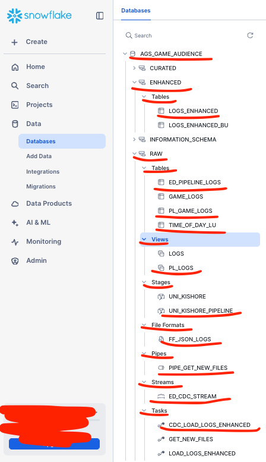
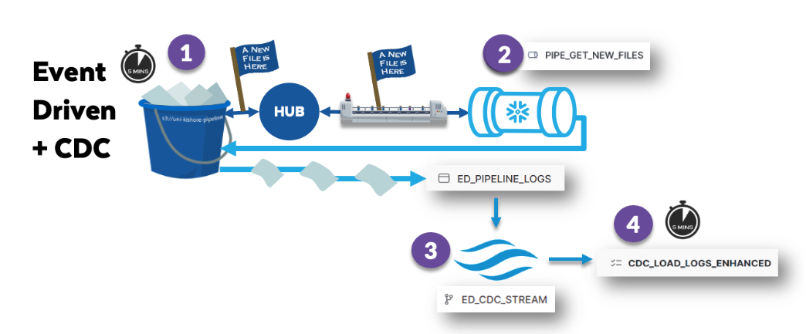
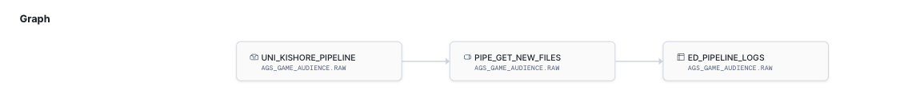

## AGS Game Audience — Event-Driven + CDC Pipeline (Snowflake)

## What this is

A portfolio-ready, reproducible Snowflake pipeline that ingests JSON logs from an AWS S3 bucket using Snowpipe, lands them in RAW, captures changes with a Stream (CDC), and loads curated data into ENHANCED via a scheduled Task. This repo was created based on the Snowflake hands-on lab badge 6 - Data Engineering.

## Key design:

S3 → Stage (…RAW.UNI_KISHORE_PIPELINE)

Snowpipe (…RAW.PIPE_GET_NEW_FILES) auto-ingests new files into …RAW.ED_PIPELINE_LOGS

Stream (…RAW.ED_CDC_STREAM) tracks new/changed rows

Task (e.g., …ENHANCED.CDC_LOAD_LOGS_ENHANCED) runs every few minutes to MERGE/UPSERT into …ENHANCED.LOGS_ENHANCED

## Repo layout (high-level)
- sql/ 
  - 000_env.sql                      # role/warehouse/db (no schema set globally) 
  - 010_file_format_raw_ff_json_logs.sql␠ 
  - 020_storage_integration_aws.sql  # S3 access (placeholders) 
  - 030_stage_raw_uni_kishore_pipeline.sql 
  - 040_table_ed_pipeline_logs.sql 
  - 041_table_logs_enhanced.sql 
  - 042_table_pl_game_logs.sql 
  - 043_table_time_of_day_lu.sql 
  - 050_view_pl_logs.sql 
  - 060_snowpipe_pipe_get_new_files.sql 
  - 070_stream_ed_cdc_stream.sql 
  - 080_task_cdc_load_logs_enhanced.sql 
- driver.sql                         # runs files in order (SnowSQL) 
- docs/database_structure_snowflake_ui.png  # the database structure in Snowflake UI  
- docs/etl_flow.png                  # the diagram above 
- docs/pipe_get_new_files_graph.png  # the pipe_get_new_files graph from Snowflake UI 

If your filenames differ, keep the same order. File order matters: file format → integrations → stage → tables → views → pipe → stream → task.

## Prerequisites 

A Snowflake account and SnowSQL (or run in Snowsight worksheets).

Role with rights to create DB/objects in AGS_GAME_AUDIENCE.

## For real S3 auto-ingest:

An AWS IAM role that Snowflake can assume (used by the storage integration) with List/Get permissions to s3://{{bucket}}/{{prefix}}/.

An SNS topic wired to your S3 bucket events (Object Created) that the pipe will subscribe to.

For portfolio use, this repo uses placeholders like {{aws_role_arn}} and {{arn:aws:sns:…}}. Do not commit real ARNs/IDs.

## Quickstart 
0) Clone & open
git clone https://github.com/natashagmueller/ags_game_audience.git
cd ags_game_audience

1) Set environment (SnowSQL variables)

Edit sql/000_env.sql defaults or pass at runtime:

snowsql -a <account> -u <user> \
  -DROLE=SYSADMIN \
  -DWAREHOUSE=COMPUTE_WH \
  -DDB=AGS_GAME_AUDIENCE \
  -f driver.sql

2) Deploy objects (driver runs files in order)

driver.sql contains:

!source sql/000_env.sql
!source sql/010_file_format_raw_ff_json_logs.sql
!source sql/020_storage_integration_aws.sql
!source sql/030_stage_raw_uni_kishore_pipeline.sql
!source sql/040_table_ed_pipeline_logs.sql
!source sql/041_table_logs_enhanced.sql
!source sql/042_table_pl_game_logs.sql
!source sql/043_table_time_of_day_lu.sql
!source sql/050_view_pl_logs.sql
!source sql/050_table_raw_ed_pipeline_logs.sql
!source sql/060_snowpipe_pipe_get_new_files.sql
!source sql/070_stream_ed_cdc_stream.sql
!source sql/080_task_cdc_load_logs_enhanced.sql

3) Wire S3 events (only for real auto-ingest)

Configure S3 → SNS (ObjectCreated) → the topic ARN used in your pipe file.

Put a few JSON files in s3://{{bucket}}/{{prefix}}/.

4) Verify ingestion

## Some handy checks:

-- Is the pipe healthy?
SELECT SYSTEM$PIPE_STATUS('AGS_GAME_AUDIENCE.RAW.PIPE_GET_NEW_FILES');

-- Recently loaded rows
SELECT * FROM AGS_GAME_AUDIENCE.RAW.ED_PIPELINE_LOGS ORDER BY load_ltz DESC LIMIT 20;

-- Stream has new rows?
SELECT * FROM AGS_GAME_AUDIENCE.RAW.ED_CDC_STREAM LIMIT 20;

-- Curated output
SELECT * FROM AGS_GAME_AUDIENCE.ENHANCED.LOGS_ENHANCED ORDER BY event_time DESC LIMIT 20;

## No-AWS demo option (optional) 

If you (or reviewers) want to test without S3:

Create an internal stage variant (you can add a second .sql file or comment the external lines):

CREATE OR REPLACE STAGE AGS_GAME_AUDIENCE.RAW.UNI_KISHORE_PIPELINE
  FILE_FORMAT = AGS_GAME_AUDIENCE.RAW.FF_JSON_LOGS;

Upload sample files from the repo:

-- From a terminal:
snowsql -a <acct> -u <user> -q "PUT file://data/sample_files/* @AGS_GAME_AUDIENCE.RAW.UNI_KISHORE_PIPELINE AUTO_COMPRESS=FALSE"

Backfill once:

ALTER PIPE AGS_GAME_AUDIENCE.RAW.PIPE_GET_NEW_FILES REFRESH;

## Important files & objects (mapping)

File format: AGS_GAME_AUDIENCE.RAW.FF_JSON_LOGS
Parses JSON logs; referenced by stage/pipe.

Storage integration: created in 020_storage_integration_aws.sql
Grants Snowflake read access to the S3 path (placeholders only).

Stage: AGS_GAME_AUDIENCE.RAW.UNI_KISHORE_PIPELINE
Points to s3://{{bucket}}/{{prefix}}/ via the storage integration.

RAW table: AGS_GAME_AUDIENCE.RAW.ED_PIPELINE_LOGS
Landing table for Snowpipe (columns: log_file_name, log_file_row_id, load_ltz, datetime_iso8601, user_event, user_login, ip_address).

Snowpipe: AGS_GAME_AUDIENCE.RAW.PIPE_GET_NEW_FILES
AUTO_INGEST=TRUE with AWS_SNS_TOPIC='{{arn:…}}'; COPY INTO …RAW.ED_PIPELINE_LOGS from the stage.

Stream (CDC): AGS_GAME_AUDIENCE.RAW.ED_CDC_STREAM
Reads changes from …RAW.ED_PIPELINE_LOGS.

Task: AGS_GAME_AUDIENCE.ENHANCED.CDC_LOAD_LOGS_ENHANCED
Runs on a cron/interval (e.g., every 5 minutes), MERGE/UPSERTs into …ENHANCED.LOGS_ENHANCED.

Curated table: AGS_GAME_AUDIENCE.ENHANCED.LOGS_ENHANCED
Final modeled table for analytics.

Operating the pipeline
-- Pause / resume pipe
ALTER PIPE AGS_GAME_AUDIENCE.RAW.PIPE_GET_NEW_FILES SET PIPE_EXECUTION_PAUSED = TRUE;
ALTER PIPE AGS_GAME_AUDIENCE.RAW.PIPE_GET_NEW_FILES SET PIPE_EXECUTION_PAUSED = FALSE;

-- Backfill (scan existing staged files)
ALTER PIPE AGS_GAME_AUDIENCE.RAW.PIPE_GET_NEW_FILES REFRESH;

-- Pause / resume the task
ALTER TASK AGS_GAME_AUDIENCE.ENHANCED.CDC_LOAD_LOGS_ENHANCED SUSPEND;
ALTER TASK AGS_GAME_AUDIENCE.ENHANCED.CDC_LOAD_LOGS_ENHANCED RESUME;

## Security & secrets

Never commit real ARNs, account IDs, or credentials. Use placeholders ({{…}}) and document them here.

Keep local overrides (e.g., 000_env.local.sql) in .gitignore if you choose the template pattern.

